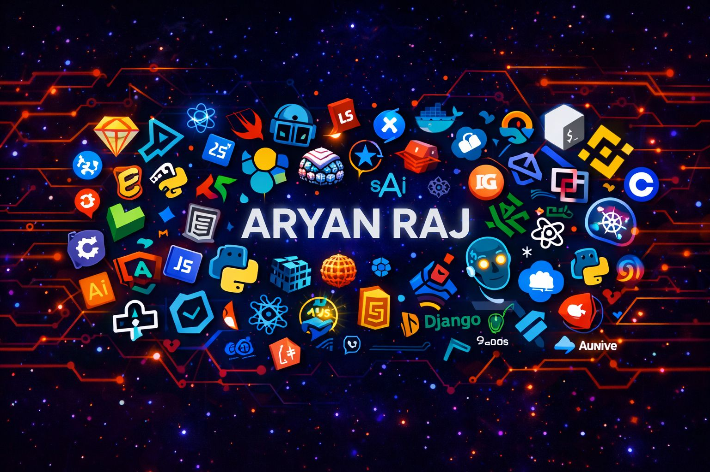

  

<h1 align="center">ARYAN RAJ</h1>

---

<h3 align="center">Aspiring AI Engineer building Agentic Systems & Scalable ML Applications</h3>

  

 

  
  
  
  

---

<h2>👋 About Me</h2>

Building intelligent AI systems that turn cutting-edge research into real-world impact.

  

<ul>
  <li>🧠 <b>Focus:</b> AI/ML • Agentic AI • Multi-Agent Systems • ML Engineering</li>
  <li>⚙️ <b>Stack:</b> Python • PyTorch • LangChain • FastAPI • React</li>
  <li>🚀 <b>Currently:</b> Building scalable AI-powered applications & pipelines</li>
  <li>🤝 <b>Open to:</b> Collaborations in AI, ML & innovative tech</li>
</ul>

 

---

<h2 align="center">🛠️ Tech Stack</h2>

  

  
  
  

---

<h2 align="center">📊 GitHub Stats</h2>

  

  

  

  

---

<!-- Footer -->

  

